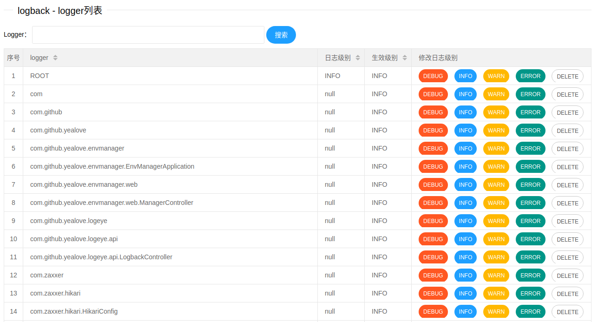

# log-eye
*基于spring boot web*

查看/修改logback日志级别

logger列表
```
GET log-eye/list
```
logger日志级别修改
```
PUT log-eye/update
{"name":"com","level":"DEBUG"}
```

logger信息
```
GET log-eye/info/{loggerName}
```

页面：
* log-eye.html
